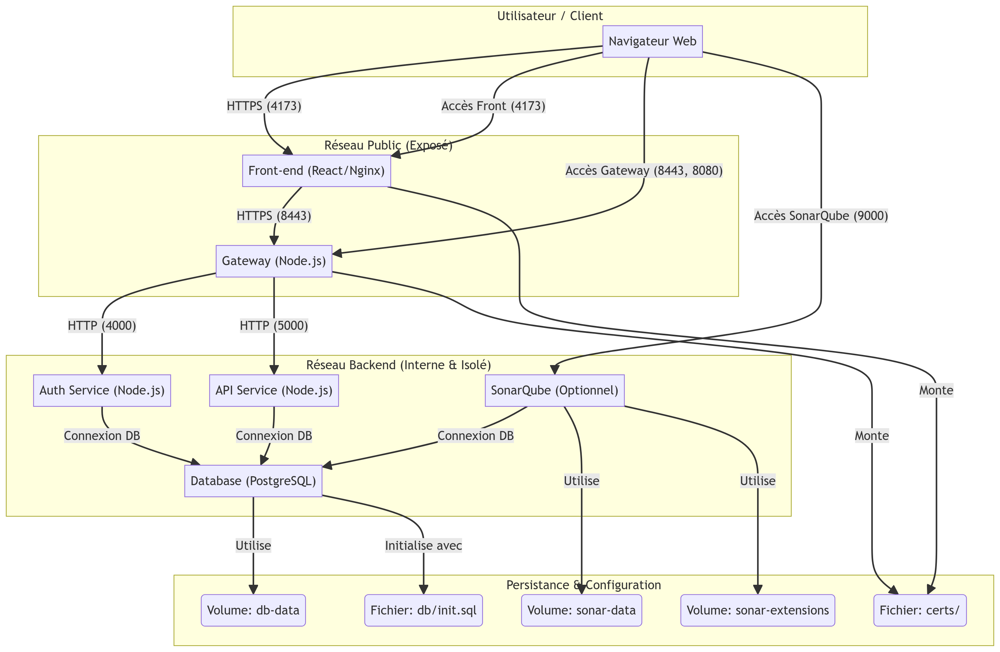

# Projet d'Application Web Dockerisée

Ce projet a pour objectif de conteneuriser une application web complète (front-end, API, base de données) en utilisant Docker et Docker Compose, afin de garantir un déploiement reproductible et isolé sur n'importe quelle machine.

## 1. Schéma d'Architecture

Le schéma ci-dessous présente l'architecture multi-conteneurs de l'application, les réseaux, les volumes et les flux de communication principaux.



## 2. Prérequis

- **Docker Engine** : version `20.10.0` ou supérieure
- **Docker Compose** : version `v2.0.0` ou supérieure
- **Système d'exploitation** : Linux, Windows (avec WSL2) ou macOS
- **Git** : pour cloner le dépôt
- **OpenSSL** ou **mkcert** : pour générer les certificats TLS

## 3. Procédure de Déploiement

### 3.1. Configuration Initiale

1.  **Cloner le dépôt :**
    ```bash
    git clone https://github.com/Vincentlbl/dockerized-web-application.git
    cd dockerized-web-application
    ```

2.  **Créer le fichier d'environnement :**
    Copiez le fichier `.env.example` et renommez-le en `.env`. Ce fichier centralise toutes les variables de configuration.
    ```bash
    cp .env.example .env
    ```

3.  **Générer les secrets :**
    Modifiez le fichier `.env` et remplacez les valeurs par défaut (comme `change_me_secret`) par des secrets forts. Vous pouvez utiliser la commande suivante pour générer des chaînes de caractères aléatoires :
    ```bash
    openssl rand -base64 32
    ```

4.  **Générer les certificats TLS :**
    Pour la communication HTTPS, vous devez générer un certificat et une clé privée. Placez-les dans le dossier `certs/`.
    ```bash
    # Exemple avec openssl
    MSYS_NO_PATHCONV=1 openssl req -x509 -newkey rsa:4096 \
      -keyout certs/dev.key \
      -out certs/dev.cert \
      -days 365 \
      -nodes \
      -subj "/CN=localhost"
    ```

### 3.2. Build et Lancement

Une fois la configuration terminée, lancez l'ensemble de la stack avec Docker Compose :

```bash
docker-compose up --build -d
```

- `--build` : force la reconstruction des images si les Dockerfiles ont changé.
- `-d` : lance les conteneurs en mode détaché (en arrière-plan).

### 3.3. Accès aux Services

- **Application Front-end** : `https://localhost:4173`
- **Gateway (API)** : `https://localhost:8443`
- **SonarQube (optionnel)** : `http://localhost:9000`

Pour lancer les services de sécurité (SonarQube), utilisez le profil `security` :
```bash
docker-compose --profile security up -d
```

### 3.4. Arrêt des Services

Pour arrêter tous les conteneurs :
```bash
docker-compose down
```

Pour arrêter et supprimer les volumes (attention, cela supprime les données) :
```bash
docker-compose down -v
```

## 4. Description des Services

| Service | Description | Ports Exposés | Réseau(x) |
| :--- | :--- | :--- | :--- |
| `front` | Interface utilisateur en React, servie par Nginx. | `4173` | `public` |
| `gateway` | Point d'entrée unique (Node.js/Express). Gère le routage, le TLS, le rate limiting. | `8443` (HTTPS), `8080` (HTTP) | `public`, `backend` |
| `auth-service` | Microservice (Node.js) pour l'authentification (JWT) et la gestion des utilisateurs. | - | `backend` |
| `api-service` | Microservice (Node.js) pour la logique métier (gestion des tickets). | - | `backend` |
| `db` | Base de données PostgreSQL pour la persistance des données. | - | `backend` |
| `sonarqube` | (Optionnel) Outil d'analyse de la qualité et de la sécurité du code. | `9000` | `backend` |

## 5. Architecture et Choix Techniques

### 5.1. Réseaux

- **`public`** : Réseau externe qui expose les services accessibles depuis le navigateur (Front-end, Gateway).
- **`backend`** : Réseau interne et isolé pour la communication entre les services back-end (API, BDD). La Gateway est le seul service ayant accès aux deux réseaux, agissant comme une passerelle sécurisée.

### 5.2. Persistance des Données

La persistance des données est garantie par l'utilisation de **volumes Docker nommés** :
- **`db-data`** : Stocke les données de la base de données PostgreSQL. Ce volume n'est pas supprimé lors d'un `docker-compose down`, ce qui préserve les données.
- **`sonar-data`** et **`sonar-extensions`** : Stockent les données et les plugins de SonarQube.

Le fichier `db/init.sql` est monté en lecture seule pour initialiser la base de données au premier lancement.

### 5.3. Sécurité et Bonnes Pratiques

- **Utilisateurs non-root** : Les Dockerfiles pour les services Node.js et Nginx créent et utilisent un utilisateur non-privilégié (`node` ou `nginx`) pour réduire la surface d'attaque en cas de compromission d'un conteneur.
- **Gestion des secrets** : Les secrets (mots de passe, clés JWT) ne sont pas codés en dur. Ils sont gérés via des variables d'environnement chargées depuis un fichier `.env` qui est ignoré par Git (via `.gitignore`).
- **Images minimales** : Utilisation d'images de base légères (ex: `postgres:15-alpine`, `node:18-alpine`) pour réduire la taille des images et la surface d'attaque.
- **Healthchecks** : Chaque service critique dispose d'un `healthcheck` pour s'assurer de son bon fonctionnement avant que les services dépendants ne démarrent.
- **Réseau interne** : Le réseau `backend` est marqué comme `internal: true`, ce qui empêche toute communication directe depuis l'extérieur vers les services back-end.
